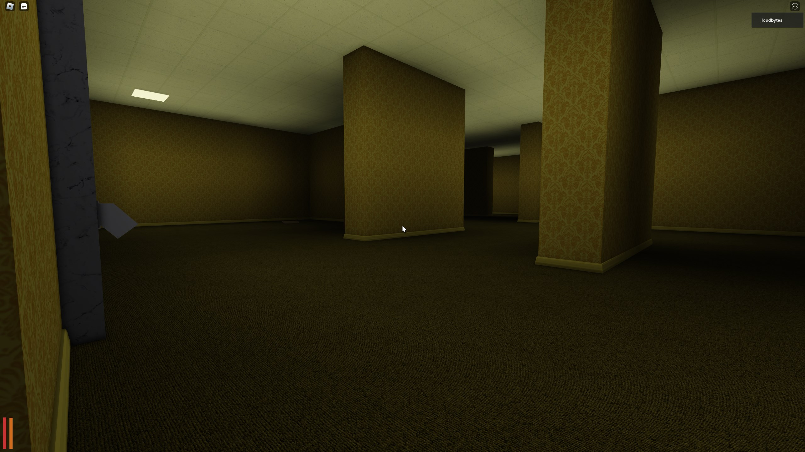
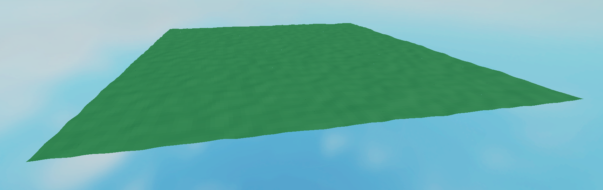

# loudbytes' Roblox Portfolio

Here's a few things I have worked on in the past few years:

## Unreleased Cart Game

A game I worked on for a few months that didn't end up getting released. Features a customizable cart system with a shop, collectibles, obstacles and abilities for your cart.

## Path Plugin

A plugin I made to create and manage paths. Originally made for moving platforms but is usable for anything that needs to move along a preset path. The UI is made in Fusion.

## Rope Swinging Test

Little prototype for a swinging game idea I had. It didn't end up going anywhere, but it sure is fun to play around with.

[Link to the game](https://www.roblox.com/games/10130525843/Rope-Swing-Test)

## Visibility Test

A little experiment I did to accurately check if an AABB is in view of the player. Uses basic frustum checks and raycasts. Can be used for enemies, illusions, etc.

## Unreleased Backrooms Game

A backrooms game I worked on that was never released. It featured a procedural generator for the map itself and a simple AI for the "entity". The generator is a simple stack-based maze generator. It generates the entire 4000x4000 studs map in less than a second.

## Triangle Terrain Generator

A terrain generator using triangles I made a while back for a game I scrapped.

## Simple Car System

A very very simple car system I made to learn the basics. I used a more advanced version for the cart game project.

## Cursed Candy Calamity

This was a collab between Adventure Club! members. It is a collectathon platformer game in the style of Super Mario Odyssey. I worked on the collectible system, the dialog system, the save/load and parts of the UI. You can play the game [here](https://www.roblox.com/games/7199015832/Halloween-2021-Cursed-Candy-Calamity)

